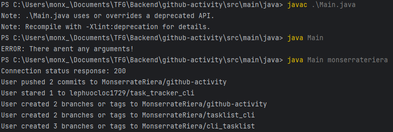

# GitHub Activity CLI 🚀

## Description

App to check the activity of a GitHub user making requests to GitHub's API.

## Installing the app 📥

1. Clone the repository

``
git clone https://github.com/MonserrateRiera/github-activity.git
``

``
cd github-activity/src/main/java
``
2. To execute its mandatory use a username as argument. Its possible make it through the IDE or CLI. Commands for CLI:
   + Compile:
``
        javac Main.java
``

   + Execute 
``
      java Main <username>
``
where username is the account we want to check the events.

## Example of use

### Project URL
I found this project in Roadmap and I'm using it to boost my Backend abilities.
https://roadmap.sh/projects/github-user-activity
